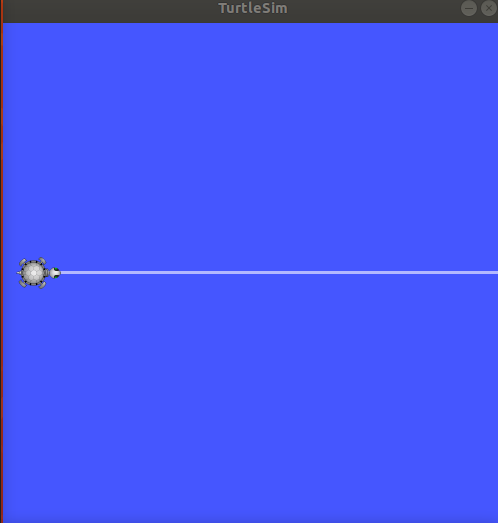
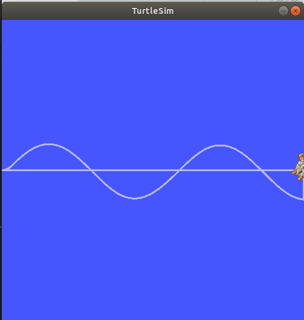

# Rosty Mathematician

Tutorial package for `turtlebot_sim`. This subscriber attempts to render given function of `x`.

## Installation
1. Install `ros` following the documentation (here)[http://wiki.ros.org/melodic/Installation].

2. Clone this package into your workspace. See tutorial on work spaces (here)[http://wiki.ros.org/ROS/Tutorials/InstallingandConfiguringROSEnvironment].

3. Build the package and make sure your `devel/setup.bash` is in your path variable.

## Usage
You have to boot ROS with

`$ roscore`

To start the UI, run

`$ rosrun turtlesim turtlesim_node`

To start the subscriber, run

`$ rosrun rosty_mathematician main.py`

### The Subscriber API
The method `tick` publishes a message to the node.
The first parameter is the change `dx` that should be done each tick.
In second parameter you specify what predicate should it use as a function of `x`.

## TODOs
Use service/client pattern or at least echo `pose` topic for more accurancy.

Specify relationship between `Hz` and `dx`.

## Screenshots

")
